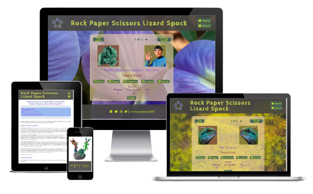
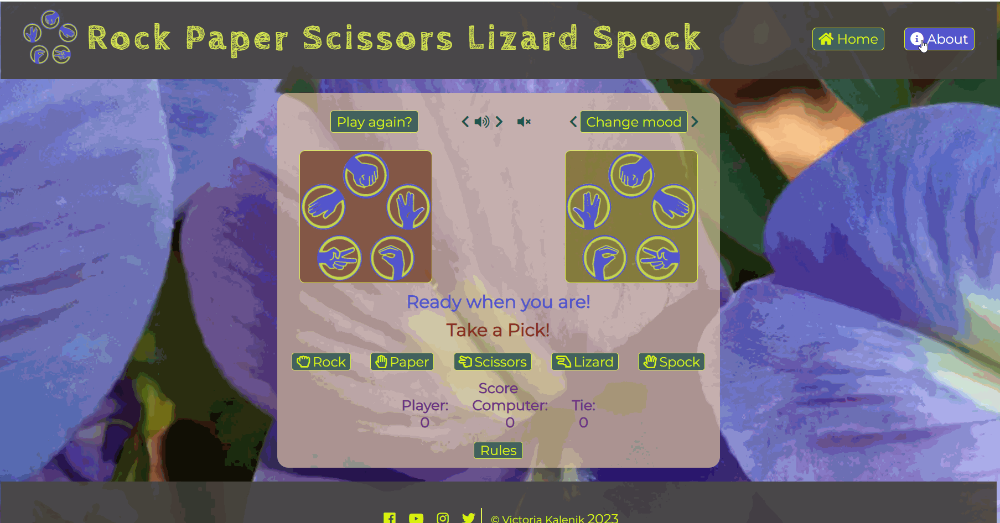
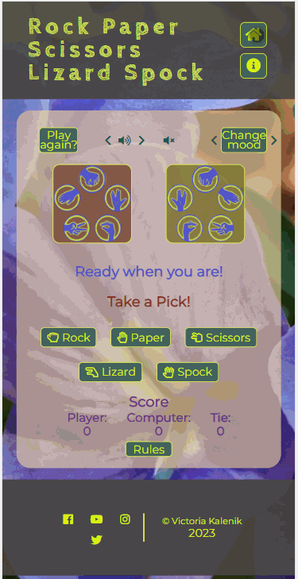
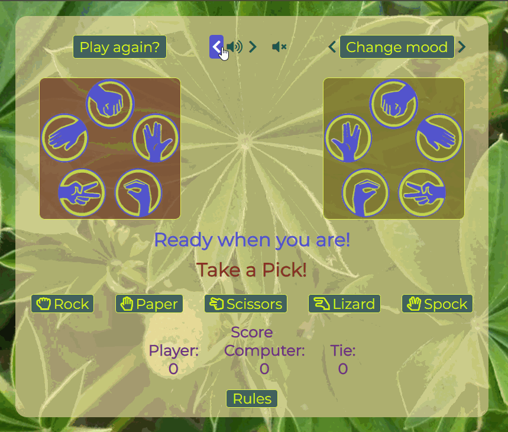
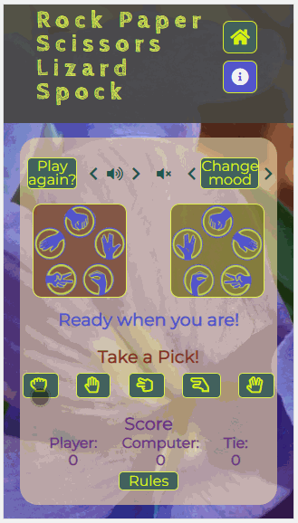
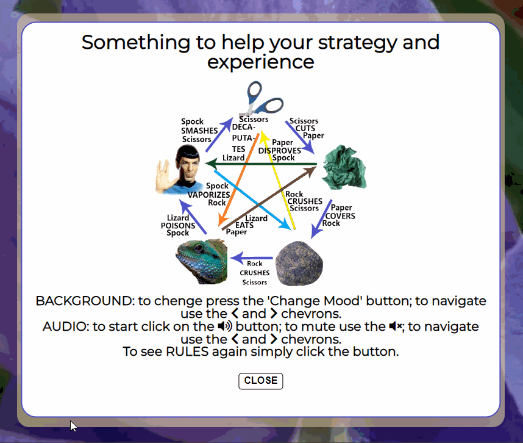
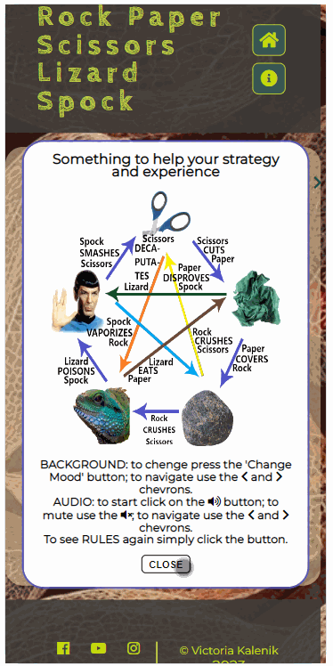
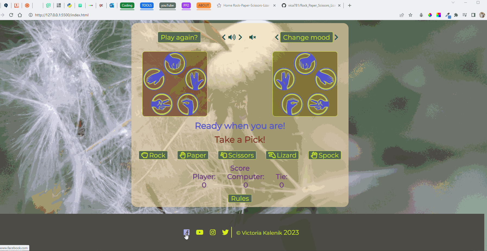
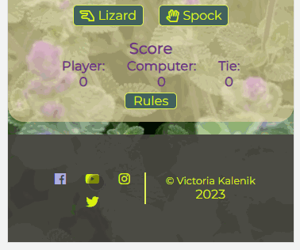

<h1 align="center">Rock Paper Scissors Lizard Spock</h1>

[View the live project here](https://vica781.github.io/Rock_Paper_Scissors_Lizard_Spock_PP2/)

## Overview

Welcome to my website **Rock, Paper, Scissors, Lizard, Spock**. This website is Portfolio Project 2 (JavaScript Essentials) of five Milestone Projects required to complete the Diploma of Full Stack Software Development with The Code Institute.

**Project purpose**: Presentation of interactive data.

**Required**: HTML, CSS, JavaScript.

**The main requirement** of this project is to build an interactive front-end site applying all of the technologies learned so far, namely HTML5, CSS3 and JavaScript. 

**The site should** respond to the users' actions, allowing users to actively engage with data, alter the way the site displays the information to achieve their preferred goals.

This website, an extended play on the classic Rock Paper Scissors game, now including the dimensions of the Lizard and Spock to add an extra level of strategy and fun! 

I really hope that, my approach not only provides a new take on this well-loved game, but also delivers an immersive experience designed to help you unwind and destress. I tried to offer a calming environment replete with soothing classical music and serene nature-based backgrounds.

## Reasons behind design
**The Power of Nature**: Research has shown that exposure to nature, even through images, can lower stress levels, improve mood, and enhance mental well-being. That's why I've incorporated beautiful, calming backgrounds inspired by macro nature photography into my game. These tranquil images can help create a serene gaming atmosphere that promotes relaxation and mindfulness.

**The Magic of Classical Music**: Classical music has long been recognized for its ability to soothe the mind and lift the spirits. Certain pieces can even help improve concentration and creativity. That's why I've included a collection of classical music pieces for you to choose from while playing the game. Let the music transport you to a world of calm and tranquility.

**The Sensory Combination**: Combining the visual beauty of nature and the harmonious sounds of classical music creates a unique sensory experience that can significantly enhance your relaxation. As you play the game, you're not just engaging your problem-solving skills, you're also immersing yourself in an environment designed to reduce stress and promote positive emotions.

A comprehensive "About" page accompanies my gameplay interface. Dive into the fascinating world of Rock Paper Scissors Lizard Spock and learn about its history, philosophy, educational significance, logical underpinnings, tactical nuances, and much more!

## Index – Table of Contents
* [User Experience (UX)](#user-experience-ux) 
* [Features](#features)
* [Design](#design)
* [Technologies Used](#technologies-used)
* [Testing](#testing)
* [Deployment](#deployment)
* [Credits](#credits)

# User Experience (UX)

### Ideal User Demographic

**THE IDEAL USER FOR THIS WEBSITE IS:**

<ins>New user:<ins>
- If you're a new visitor to my site, welcome! Whether you're an enthusiast of strategy games, or just looking for a fun distraction. I am really hoping that I've achieved my goal to design a straightforward and user-friendly game. 
- You'll find clear instructions and rules for playing the game.
- Throughout the game, you'll be assisted by clear and intuitive navigation.
- Furthermore, you will be assisted by informative and concise messages that will help you navigate the game and understand the rules. 
- Furthermore, you can explore the rich resources on About page to learn more about the game's intriguing aspects. Join me today and discover a delightful blend of relaxation and mental stimulation!

<ins>Current Users:<ins>

To a current users, thank you for your continued support! Challenge yourself with a round of the game, appreciate the calming music and beautiful backgrounds, or delve deeper into the fascinating world of Rock Paper Scissors Lizard Spock through the comprehensive About page. Your feedback, either through forums, comments, or social media links, sharing the experience or strategies in playing the game, is always appreciated as it helps me improve and bring more joy to the community.

<ins>Returning Users<ins>

Welcome back! I am thrilled to see you again. Dive right back into the game for enjoyment and relaxation, or take your time to explore an updated collection of serene backgrounds and calming classical music. Reconnect with the simplicity and joy of Rock Paper Scissors Lizard Spock today!

[Back to top ⇧](##index-table-of-contents) 

## **USER STORIES**

###  <ins>First Time Visitor Goals<ins>
    
   Idealy, as a new user I want to be able to:
1. As a first time visitor, I want to understand the purpose of the site and learn about the game Rock Paper Scissors Lizard Spock.
2. As a first time visitor, I want to be able to navigate the website easily, find the game rules and instructions, and be able to start playing the game without any difficulties. 
3. As a first time visitor, I want to enjoy the calming and destressing elements of the website, like the serene nature backgrounds and soothing classical music. 
4. As a first time visitor, I want to explore the About page and learn more about the history, philosophy, educational aspects, logical components, tactical strategies of the game, and interesting facts about the game.
5. As a first time visitor, I want to be able to provide feedback or ask for help in case I need any, either through forums, comments, or social media links, sharing my experience or strategies in playing the game.
      
  ### <ins>Returning Visitor Goals<ins>

   As a current/returning user I want to be able to:
1. As a returning visitor, I want to be able to play the Rock Paper Scissors Lizard Spock game quickly, without needing to go through lengthy processes or instructions. 
2. As a returning visitor, I want to see new elements or updates in the game, including new nature backgrounds and classical music to keep my experience fresh and enjoyable. 
3. As a returning visitor, I want to find new, fascinating facts, insights, or resources on the About page that enhance my understanding and appreciation of the game. 
4. As a returning visitor, I want a consistent, user-friendly interface where I can easily navigate to my desired sections. 
5. As a returning visitor, I want to engage more with the community, either through forums, comments, or social media links, sharing my experience or strategies in playing the game.

##  **FEATURES**

### **Existing Features**

-   **Navigation Bar**

    - The navigation bar has a consistent look and placement on all pages of the website supporting easy navigation.
    
      It includes a simple Logo, HOME and ABOUT links and is responsive on multiple screen sizes:  
         
    - *On large* screens buttons are equipped with word description 'Home' and 'About' as well as icons to assist user with navigation. The buttons have a hover effect to indicate to the user that they are clickable. Also, on hover the buttons change background and text colour to indicate to the user that they are active. The Logo has been linked to the Home page for user convenience. 
    
    

     

    - *On small and medium* screens the structure of navigation bar is adapting to a size. The logo is removed and the buttons have only icons to indicate 'home' and 'information'. The buttons have a hover effect to indicate to the user that they are clickable. Also, on hover the buttons change background and text colour to indicate to the user that they are active.
  
     

     

-   **Audio and Background Change** controls are located on the top of the game field for the convenience of the user. The buttons have a hover effect to indicate to the user that they are clickable. Also, on hover the buttons change background and text colour to indicate to the user that they are active.
 
    

    

-   **The Game Field** for the convenience of the user located in the centre of the screen . The field is equipped with the following elements:
    - *Game Field Background* for the user convenience and to set clear boundries of the Game Field. It is of a sutable pastel colour and transparency (to allow all elements to be easy readable, as well as allow to see main page background). 
    - *'Player Choice' and 'Computer Choice' areas* that displaying reflected on the Y-axis images of the corresponding choices are distinguished by the individually coloured background. The colours are chosen to be in contrast with the Game Field Background and each other.  
    - *'Computer Choice' area* has been designed to emitated the movement of the slot machine. The images are changing in a random order and then stop on the final choice. This is to add a bit of excitement to the game.
    - *Game Score* is displayed at the bottom of the game field for the convenience of the user. The score board is displaying player's, computer's and the tie score. The score is updated after each round of the game. The score is reset to 0 after the Game has been restarted by cleacking on the 'Play again?' button. Player is prompted to restart the game after the total Score reaches 20.
    -  *Messages*
        - **Ready when you are!** message placed in the centre of the game field to indicate to the user that they need to make a choice. The message is located immediately under the Player's and Computer's choice fields and above 'Take a Pick!' message.
        - **Take a Pick!** message placed in the centre of the game field to indicate to the user that they need to make a choice. The message is located above five buttons with the icons/images of the choices accompanied with the worded name. The buttons have a hover effect to indicate to the user that they are clickable. Also, on hover the buttons change background and text colour to indicate to the user that they are active.
        - **You have chosen...** message, replacing 'Ready when you are!' message as soon as player made the choice by clicking on the button of thier prefered choice of the weapon, to confirm to the user the type of the weapon they have choosen. This message stays on the screen until the computer makes it's choice.
        - **The outcome message** replacing 'You have chosen...' message as soon as computer made it's choice. The message is informing the user about the outcome of the round. The message is combyning the rule relevant to the weapons chosen in the round ('Spock smashes scissors', 'Lizard eats paper' and so on) and anounces the winner 'You won!' or 'Computer wins!'. Also, in the event of weapons of choice beeing the same, player being informed by the 'It's a tie' message accompanied by the icon of a handshacke. The message is staying on the screen until the user makes a new weapon cnoice or clicks on the 'Play again?' button.
        - All **messages** are colour differentiated for the user convenience. The colours are chosen to be in contrast with the Game Field Background and each other.  
  
      

    - **Rules** button is located at the bottom of the game field for the convenience of the user. The button has a hover effect to indicate to the user that they are clickable. Also, on hover the buttons change background and text colour to indicate to the user that they are active. The button is linked to the 'Modal' for user convenience.
    - **Responsive** design of the *game field* allows user to play the game on any screen size. The game field is adapting to the screen size by changing the size of the images and the size of the buttons. Including the player's choice buttons. 
    
    
    
-   **The Modal** is located in the centre of the screen for the convenience of the user. By the Game design Modal is automatically displaied on the page load; loctaed at the centre of the Home screen covering the Game Field and preventing any interaction with page elements. The modal is equipped with the following elements:
    - None transparant white **background** for the user convenience and to set clear boundries of the Modal.  
    - **Modal Header** intended as welcoming and explanotary message to inform the user about the content of the modal.
    - **Modal Body** displaying Game Rules in a pentagonal/star shape image, where each of five vertices are representing one of the five game weapons. All weapons/characters connected with each other by the arrows. The arrows are indicating the outcome of the game, for example 'Spock smashes scissors', 'Lizard eats paper' and so on. The lines are colour differentiated for the user convenience. The colours are chosen to be in contrast with the Modal Background and each other.
    - **Game Controls** - brief explanation of purpose of the Audio and Background Change buttons located at the top of the Game Field.     
    - **Close** button is located at the bottom of the modal for the user convenience. The name is to inform the user about the function of the button. The desktop users, also, can close Modal by using 'esc' button on the keyboard. 
        
     

    - **Responsive** design of the *modal* allows user to read the content on any screen size. The modal is adapting to the screen size by changing the size of the text and the size of the ' Close' button. 

    

-  **The Footer** - has a consistent look and placement on all pages of the website supporting easy navigation and providing user with the links to the social media. The footer is equipped with the following elements:
    - *Footer Background* of matching to the navigation bar colour for the user convenience and to set clear boundries of the.  
    - *Social Media Icons* are of contrasting with background colour, matching colour of nav bar heading for concistancy. The icons have a hover effect to indicate to the user that they are clickable. Also, on hover the icons change background and text colour to indicate to the user that they are active. The icons are linked to the corresponding social media web sites in a new window. 
    - *Footer Text* is minimalistic and consists name of the author and the current year. The text is of contrasting with background colour and matching colour with social media icons for concistancy. 

    

    - **Responsive** design of the *footer* allows user to read the content on any screen size. The footer is adapting to the screen size by changing the size of the text and the size of the icons. 

    

-   **The About Page** - The page is equipped with the following elements:

 
 
 
 
 
 
 
 
 
 
## **FEATURES WHICH COULD BE IMPLEMENTED IN THE FUTURE**

-  **Logo Image** next to Discover Amber Logo corresponding with website's favicon. This is should be an easy fix, but I was not able to find that fix despite multiple  
   different attempts 
   

   - Just, as I writing this lines, decidet to try again. Below is the results:
     - The navigation tabs moved to the line under the nav-bar. 

    
   
     - The 'hamburger' menu background with the content displaysed on all screen sizes, for some widths worth than others. 
       The decision has been made to return back to previous layout and work on the improvement at the later date.
   
    
   
   
   

- **History Page** - the original design of the website, until last few days before the Project dead line, contained four animated panels on the Landing Page. Realising that I have over estimated my abilities, experience and personal circumstances, I had to take note of advice and 'cut down' on the volume of the website. As the History Page was not quite finished, I made a decision to save it for the later development. The page originally meant to contain natural history of the amber, physical and chemical properties; information about amber inclusions and value they present to the modern scientist.
   

       

- **Scrolling Background** - I would like to learn how to stop background to scroll behind 'hamburger' menu when the latter is in use. I have studied some resources and tried to implement few suggestions, but the issue is still remaining.

    

- **Language Button** - there are few reasons I would liked to add a Language button to my website:
  - Amber is mined in many regions of the world, but the largest deposit is on the Baltic Sea, in the Kaliningrad region. The Kaliningrad Amber Combine is the only official amber mine in Russia and accounts for 65% of the global amber market. Region holds 90% of the world's extractable amber. Also, it is a popular tourist region and widely visited by tourists from many countries, the local users can find the website useful and interesting too.
  -	Perhaps, it would be beneficial to the users from other non-English speaking countries to be able to have choice of a language.
  -	As a bilingual speaker, I am proud of my roots and love my first language. English is not my first language and I would like to share my progress in this Course with my family and friends, but not all of them are fluent in English.

- **Usage Page** - taking in concideration the aim of this project and the time given, I have only mentioned a tiny fraction of the areas where humans found aplication for amber. There is still so much I would like to share with the user. Amber has been used by humans since ancient times. It is studied by geologists, palaeontologists and geochemists. The use of amber in medicine, cosmetology, pharmacology and perfume industry deserves a separate website! Also, there are many legends and folks’ stories about the amber.

- **Gifts Page** - perhaps, can be improved as well be providing user with the links to the websites where they can find products displayed in the gallery. Also, due to the many reasons, I was not able to provide every image with the description. Hence, that can be added at a later stage.

Also, I would like to address the following: 
   - There is corsoure pointer abailable on a screen when using Gifts' Page gallery. That aid user intuitevelly know that there is something to check/click.
   - Unfortunatelly, when exploring Gifts' Page gallery on a mobile device, there are no obveouse clues that there is the content at the back of some images. 
         
## **DESIGN**

-   ### Imagery

    -  The images for the *Landing Page* have been chosen as they are eye-catching, sutable thematically, perfect colour vise and intriguing/inviting to discover what connecting them to amber. These images help to keep page simple, slick and inviting to explore. 

    -  *Gifts Page* - a special consideration has been given to the images on this page. To follow the general style of the website and continuity, images were chosen on a white background. On it's turn that dictated some styling difficulties. After adding appropriately selected background colour and creating masonry gallery, I have realised that the page looks like ordinary Google search page. The aim was to provide user with unusual, original, exciting (even for the familiar with amber user) and useful information. That is how the idea of the gallery of the images with descriptive information at the back was born.  
   
-   ### Colour Scheme

    -  Amber is a fossilized resin that can vary in colour, ranging from yellow to brown to reddish orange. The colour of amber is influenced by the type of tree it came from and the location where it was formed, as well as other factors such as the presence of impurities and the amount of time it has been exposed to sunlight. 
    
    -  Rare amber colours include green, blue, and violet. These colours are caused by the presence of different impurities in the resin, such as iron, copper, or chlorine. Blue and green amber are highly prized for their rarity and beauty. These colours are often found in smaller pieces and are therefore more expensive than the more common yellow to brown ambers.

    Above facts had influence on my decisions when I was selecting images, specifically Landing Page once, deciding on the colours of navigation bar buttons and 'hamburger' menu background.

     

    

    Initially, I have chosen colours intuitively. Then, I have used ColorPick Eyedropper and Color Picker from Chrome, and image with multicoloured amber to check if my choice was a good one. 

    Also, I have used to check my colour palette inspiration by using ColorSpace - Color Palettes [Generator_and_Color_Gradient_Tool](https://mycolor.space/?hex=%23E4782B&sub=1)

    

     

    
   
-   ### Typography

    -   Google Fonts were used to import Oswald and Montserrat fonts into styles.css.  
    -   These were chosen as they work well together and have a simple, unembellished, modern feel that is easy to read.
    -   At the start of the design I tried to choose fonts Google Fonts manually, but found this approach impractical and time consuming. I can recall that whilst working on Love Running project in one of the videos Google Font had feature of paring fonts. Unfortunately, this function is not available now (as a least, I have not been able to find it); and users have to pick fonts manually. 
    -   My student son did not approve choice of the fonts I made. Therefore, I and my son tried to research the topic of good font choices. Reading through several resources, I liked information provided at Sergei Davidov on Web Design [The_30_Best_Font_Combinations_for_Web_Design_(2022)](https://elementor.com/blog/font-pairing/)

        

-   ### Wireframes

    - Though, wireframes are not mandatory in web design but they are widely used as a best practice to help clarify design goals and requirements, improve collaboration between designers and stakeholders, and streamline the design and development process.
    
    - I fully support and understand that wireframes are important for web design as they provide a visual representation of the layout and structure of a website before it is built, helping to ensure that the end product meets the design goals and requirements.

    - Unfortunately, I don't have a dissent Wireframe to produce on this occasion. This is the best I have got at the moment:

    

     

    - I have researched most popular wireframe building platforms available (Balsamiq, Axure, Sketch, Adobe XD, Figma, InVision Studio, Moqups, UXPin, Marvel App and
      Justinmind) and spent hours in an attempt to build my website mock-up, wireframes and website logo. In the end, I have just abundant the idea promising myself that I will master it in a less stressful and time pushing environment.
    
    

      

## **Technologies Used**

### Languages Used

-   [HTML5](https://en.wikipedia.org/wiki/HTML5)
-   [CSS3](https://en.wikipedia.org/wiki/Cascading_Style_Sheets)

### Frameworks, Libraries & Programs Used

-   [Google Fonts:](https://fonts.google.com/) was used to import the 'Oswald' and 'Monserrat' fonts into the style.css file which are used on all pages of the project.
-   [Font Awesome:](https://fontawesome.com/) was used to add icons for aesthetic and UX purposes.
-   [Git:](https://git-scm.com/) was used for version control by utilising the Gitpod terminal to commit to Git and Push to GitHub.
-   [GitHub:](https://github.com/) is used as the respository for the projects code after being pushed from Git.
-   [Microsoft Paint 3D:](https://www.microsoft.com/en-us/p/paint-3d/9nblggh5fv99?activetab=pivot:overviewtab) was used for resizing images and editing photos for the website.
-   [WebP Converter:](https://www.freeconvert.com/webp-converter) was used to convert images to webp.
-   [Figma:](https://www.figma.com/login) was used in unsuccessful attempt to creat wireframes and website logo
-   [Image to WEBP Converter:](https://converter.11zon.com/en/image-to-webp/) was used to convert images to webp.
-   [CSS Beautifier:](https://www.freeformatter.com/css-beautifier.html#before-output) was used to format (beautify) style.css.
-   [Image to WEBP Converter:](https://www.freeformatter.com/html-formatter.html#before-output) was used to format (beautify) index.html, usage.html, rare.html, gifts.html, 
    contact.html and 404.html  
    
## TESTING

### Validator Testing

- [HTML Validator](https://validator.w3.org/)

    - result for index.html
      
    - result for usage.html
      
             
    - result for rare.html
      
    - result for gifts.html
      
    - result for contact.html
        
      

### Results after the bugs fixing
   - result for index.html  
     
     
     - there is still a warning remaining on index.html after the final validation. I was given an instruction by my mentor to change *div* to *section*.
       I don't have reason to disrespect that instruction/advice.
 
     
     

   - result for usage.html
     
   - result for rare.html  
     
   - result for gifts.html 
     
   - result for contact.html
            
    
- [CSS Validator](https://jigsaw.w3.org/css-validator/)

    - result for styles.css 
      
      

      I used the code shown in the warning to remove up-wards and down-wards pointing arrows in the telephone input field of the form. As these arrows were allowing to increase and decrease values in the input field, which is not appropreate for the telephone numbers. I have obtained the code as a result of extensive research and tried various methods to resolve the issue beforehand.
    
    ### Lighthouse testing for Performans, Accessibillity, Best Practices and SEO
    
    
    
    
    
    
    
    ### Browser Compatibility
  Testing has been carried out on the following browsers :
    - Chrome     
    - Firefox 
    - Edge 
    - Vivaldi 
    - Brave 

    ### Navigation Bar links, Contact Form and Footer icons validation

  - Testing has been carried out on all tabs of the menu bar to make sure that active pages displayed correctly, tabs are changing colour on hover during navigation, and links 
    from the nav tabs are functioning.
     
    

  - Testing has been carried out on all input fields of the Contact Form to make sure that all areas marked as 'required' are functioning properly.  
      
            
  
  - Testing has been carried out on all social media icons of the footer to make sure that all icons are functioning properly and open in a corresponding to the media web site 
    in a new window.  
     
    
 
     
## Deployment

### How this site was deployed

- The site was deployed to GitHub pages. The steps to deploy are as follows:
   - In the GitHub repository, navigate to the Settings tab
   - From the left side menu select Pages.
   - From the source section drop-down menu, select the main branch and click on save.
   - Once the main branch has been selected and saved, the page will be automatically refreshed with a detailed ribbon display to indicate the successful deployment.
   - The live link can be found here [DISCOVER AMBER](https://vica781.github.io/Discover-Amber_2/) 

## CREDITS 

### Content 
   -  Most of the content has been researched and put together from the multiple web sites dedicated to amber. All of the information obtained has been translated from Russian language to English and presented by the developer.  
   
### Code
   - The inspiration for the 'hamburger' menu and navigation bar came after warching this video on the YouTube:
   [Nav_Bar_Hamburger](https://www.youtube.com/watch?v=oLgtucwjVII&t=400s)  
  
   - The idea of animated panels on the Landing page has been taken from FreeFrontEnd website [Panels_Landing_Page_Image_Hover_Over_Effect](https://freefrontend.com/css-image-effects/#image-shadow-effects). Crtedits go to Mert Cukuren.

   - The solution for the Gifts Gallery images, also, came from FreeFrontEnd website [Image_Cards_Hover](https://freefrontend.com/css-cards/). Crtedits go to Luan Manara.

   - The images were downloaded from different sources, mainly from the dedicated amber websites, because there are so many, it would be too tedious to list all of them. Though, 
    I appreciate the rightful ownership of all of them.   

###  ACKNOWLEDGEMENTS 

- I would like to thank my mentor Brian Macharia who guided me for his dedication, calmness and useful advices. I believe, that without his help and support I wouldn't be able 
  to finish this project.

- I would also like to thank my son Timothy and his friend Sam for usefull tips and testing.