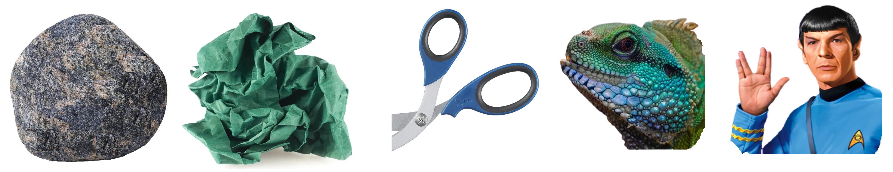

<h1 align="center">Rock Paper Scissors Lizard Spock</h1>

[View the live project here](https://vica781.github.io/Rock_Paper_Scissors_Lizard_Spock_PP2/)

## Overview

Welcome to my website **Rock, Paper, Scissors, Lizard, Spock**. This website is Portfolio Project 2 (JavaScript Essentials) of five Milestone Projects required to complete the Diploma of Full Stack Software Development with The Code Institute.

**Project purpose**: Presentation of interactive data.

**Required**: HTML, CSS, JavaScript.

**The main requirement** of this project is to build an interactive front-end site applying all of the technologies learned so far, namely HTML5, CSS3 and JavaScript. 

**The site should** respond to the users' actions, allowing users to actively engage with data, alter the way the site displays the information to achieve their preferred goals.

This website, an extended play on the classic Rock Paper Scissors game, now including the dimensions of the Lizard and Spock to add an extra level of strategy and fun! 

I really hope that, my approach not only provides a new take on this well-loved game, but also delivers an immersive experience designed to help you unwind and destress. I tried to offer a calming environment replete with soothing classical music and serene nature-based backgrounds.

## Reasons behind design
**The Power of Nature**: Research has shown that exposure to nature, even through images, can lower stress levels, improve mood, and enhance mental well-being. That's why I've incorporated beautiful, calming backgrounds inspired by macro nature photography into my game. These tranquil images can help create a serene gaming atmosphere that promotes relaxation and mindfulness.

**The Magic of Classical Music**: Classical music has long been recognized for its ability to soothe the mind and lift the spirits. Certain pieces can even help improve concentration and creativity. That's why I've included a collection of classical music pieces for you to choose from while playing the game. Let the music transport you to a world of calm and tranquility.

**The Sensory Combination**: Combining the visual beauty of nature and the harmonious sounds of classical music creates a unique sensory experience that can significantly enhance your relaxation. As you play the game, you're not just engaging your problem-solving skills, you're also immersing yourself in an environment designed to reduce stress and promote positive emotions.

A comprehensive "About" page accompanies my gameplay interface. Dive into the fascinating world of Rock Paper Scissors Lizard Spock and learn about its history, philosophy, educational significance, logical underpinnings, tactical nuances, and much more!

## Index – Table of Contents
* [User Experience (UX)](#user-experience-ux) 
* [Features](#features)
  * [Existing Features](#existing-features)
  * [Future Features](#possible-future-features)
* [Design](#design)
  * [Imagery](#imagery)
  * [Colour Scheme](#colour-scheme)
  * [Typography](#typography)
  * [Wireframes](#wireframes)
* [Technologies Used](#technologies-used)
* [Testing](#testing)
* [Deployment](#deployment)
* [Credits](#credits)

# User Experience (UX)

### Ideal User Demographic

**THE IDEAL USER FOR THIS WEBSITE IS:**

<ins>New user:<ins>
- If you're a new visitor to my site, welcome! Whether you're an enthusiast of strategy games, or just looking for a fun distraction. I am really hoping that I've achieved my goal to design a straightforward and user-friendly game. 
- You'll find clear instructions and rules for playing the game.
- Throughout the game, you'll be assisted by clear and intuitive navigation.
- Furthermore, you will be assisted by informative and concise messages that will help you navigate the game and understand the rules. 
- Furthermore, you can explore the rich resources on About page to learn more about the game's intriguing aspects. Join me today and discover a delightful blend of relaxation and mental stimulation!

<ins>Current Users:<ins>

To a current users, thank you for your continued support! Challenge yourself with a round of the game, appreciate the calming music and beautiful backgrounds, or delve deeper into the fascinating world of Rock Paper Scissors Lizard Spock through the comprehensive About page. Your feedback, either through forums, comments, or social media links, sharing the experience or strategies in playing the game, is always appreciated as it helps me improve and bring more joy to the community.

<ins>Returning Users<ins>

Welcome back! I am thrilled to see you again. Dive right back into the game for enjoyment and relaxation, or take your time to explore an updated collection of serene backgrounds and calming classical music. Reconnect with the simplicity and joy of Rock Paper Scissors Lizard Spock today!

[Back to top ⇧](#index--table-of-contents) 

## **USER STORIES**

###  <ins>First Time Visitor Goals<ins>
    
   Idealy, as a new user I want to be able to:
1. As a first time visitor, I want to understand the purpose of the site and learn about the game Rock Paper Scissors Lizard Spock.
2. As a first time visitor, I want to be able to navigate the website easily, find the game rules and instructions, and be able to start playing the game without any difficulties. 
3. As a first time visitor, I want to enjoy the calming and destressing elements of the website, like the serene nature backgrounds and soothing classical music. 
4. As a first time visitor, I want to explore the About page and learn more about the history, philosophy, educational aspects, logical components, tactical strategies of the game, and interesting facts about the game.
5. As a first time visitor, I want to be able to provide feedback or ask for help in case I need any, either through forums, comments, or social media links, sharing my experience or strategies in playing the game.
      
  ### <ins>Returning Visitor Goals<ins>

   As a current/returning user I want to be able to:
1. As a returning visitor, I want to be able to play the Rock Paper Scissors Lizard Spock game quickly, without needing to go through lengthy processes or instructions. 
2. As a returning visitor, I want to see new elements or updates in the game, including new nature backgrounds and classical music to keep my experience fresh and enjoyable. 
3. As a returning visitor, I want to find new, fascinating facts, insights, or resources on the About page that enhance my understanding and appreciation of the game. 
4. As a returning visitor, I want a consistent, user-friendly interface where I can easily navigate to my desired sections. 
5. As a returning visitor, I want to engage more with the community, either through forums, comments, or social media links, sharing my experience or strategies in playing the game.

[Back to top ⇧](#index--table-of-contents)

##  **FEATURES**

### **Existing Features**

-   **Navigation Bar**

    - The navigation bar has a consistent look and placement on all pages of the website supporting easy navigation.
    
      It includes a simple Logo, HOME and ABOUT links and is responsive on multiple screen sizes:  
         
    - *On large* screens buttons are equipped with word description 'Home' and 'About' as well as icons to assist user with navigation. The buttons have a hover effect to indicate to the user that they are clickable. Also, on hover the buttons change background and text colour to indicate to the user that they are active. The Logo has been linked to the Home page for user convenience. 
    
      

     

    - *On small and medium* screens the structure of navigation bar is adapting to a size. The logo is removed and the buttons have only icons to indicate 'home' and 'information'. The buttons have a hover effect to indicate to the user that they are clickable. Also, on hover the buttons change background and text colour to indicate to the user that they are active.
  
       

     

    [Back to top ⇧](#index--table-of-contents)

     

-   **Audio and Background Change** controls are located on the top of the game field for the convenience of the user. The buttons have a hover effect to indicate to the user that they are clickable. Also, on hover the buttons change background and text colour to indicate to the user that they are active.
 
    

    

-   **The Game Field** for the convenience of the user located in the centre of the screen . The field is equipped with the following elements:
    - *Game Field Background* for the user convenience and to set clear boundries of the Game Field. It is of a sutable pastel colour and transparency (to allow all elements to be easy readable, as well as allow to see main page background). 
    - *'Player Choice' and 'Computer Choice' areas* that displaying reflected on the Y-axis images of the corresponding choices are distinguished by the individually coloured background. The colours are chosen to be in contrast with the Game Field Background and each other.  
    - *'Computer Choice' area* has been designed to emitated the movement of the slot machine. The images are changing in a random order and then stop on the final choice. This is to add a bit of excitement to the game.
    - *Game Score* is displayed at the bottom of the game field for the convenience of the user. The score board is displaying player's, computer's and the tie score. The score is updated after each round of the game. The score is reset to 0 after the Game has been restarted by cleacking on the 'Play again?' button. Player is prompted to restart the game after the total Score reaches 20.
    -  *Messages*
        - **Ready when you are!** message placed in the centre of the game field to indicate to the user that they need to make a choice. The message is located immediately under the Player's and Computer's choice fields and above 'Take a Pick!' message.
        - **Take a Pick!** message placed in the centre of the game field to indicate to the user that they need to make a choice. The message is located above five buttons with the icons/images of the choices accompanied with the worded name. The buttons have a hover effect to indicate to the user that they are clickable. Also, on hover the buttons change background and text colour to indicate to the user that they are active.
        - **You have chosen...** message, replacing 'Ready when you are!' message as soon as player made the choice by clicking on the button of thier prefered choice of the weapon, to confirm to the user the type of the weapon they have choosen. This message stays on the screen until the computer makes it's choice.
        - **The outcome message** replacing 'You have chosen...' message as soon as computer made it's choice. The message is informing the user about the outcome of the round. The message is combyning the rule relevant to the weapons chosen in the round ('Spock smashes scissors', 'Lizard eats paper' and so on) and anounces the winner 'You won!' or 'Computer wins!'. Also, in the event of weapons of choice beeing the same, player being informed by the 'It's a tie' message accompanied by the icon of a handshacke. The message is staying on the screen until the user makes a new weapon cnoice or clicks on the 'Play again?' button.
        - All **messages** are colour differentiated for the user convenience. The colours are chosen to be in contrast with the Game Field Background and each other.  
  
      
           
    - **Rules** button is located at the bottom of the game field for the convenience of the user. The button has a hover effect to indicate to the user that they are clickable. Also, on hover the buttons change background and text colour to indicate to the user that they are active. The button is linked to the 'Modal' for user convenience.
    - **Responsive** design of the *game field* allows user to play the game on any screen size. The game field is adapting to the screen size by changing the size of the images and the size of the buttons. Including the player's choice buttons. 
    
      

       

    [Back to top ⇧](#index--table-of-contents)

     
    
-   **The Modal** is located in the centre of the screen for the convenience of the user. By the Game design Modal is automatically displaied on the page load; loctaed at the centre of the Home screen covering the Game Field and preventing any interaction with page elements. The modal is equipped with the following elements:
    - None transparant white **background** for the user convenience and to set clear boundries of the Modal.  
    - **Modal Header** intended as welcoming and explanotary message to inform the user about the content of the modal.
    - **Modal Body** displaying Game Rules in a pentagonal/star shape image, where each of five vertices are representing one of the five game weapons. All weapons/characters connected with each other by the arrows. The arrows are indicating the outcome of the game, for example 'Spock smashes scissors', 'Lizard eats paper' and so on. The lines are colour differentiated for the user convenience. The colours are chosen to be in contrast with the Modal Background and each other.
    - **Game Controls** - brief explanation of purpose of the Audio and Background Change buttons located at the top of the Game Field.     
    - **Close** button is located at the bottom of the modal for the user convenience. The name is to inform the user about the function of the button. The desktop users, also, can close Modal by using 'esc' button on the keyboard. 
        
       

    - **Responsive** design of the *modal* allows user to read the content on any screen size. The modal is adapting to the screen size by changing the size of the text and the size of the ' Close' button. 

      

       

    [Back to top ⇧](#index--table-of-contents)

     

-  **The Footer** - has a consistent look and placement on all pages of the website supporting easy navigation and providing user with the links to the social media. The footer is equipped with the following elements:
    - *Footer Background* of matching to the navigation bar colour for the user convenience and to set clear boundries of the.  
    - *Social Media Icons* are of contrasting with background colour, matching colour of nav bar heading for concistancy. The icons have a hover effect to indicate to the user that they are clickable. Also, on hover the icons change background and text colour to indicate to the user that they are active. The icons are linked to the corresponding social media web sites in a new window. 
    - *Footer Text* is minimalistic and consists name of the author and the current year. The text is of contrasting with background colour and matching colour with social media icons for concistancy. 

      

    - **Responsive** design of the *footer* allows user to read the content on any screen size. The footer is adapting to the screen size by changing the size of the text and the size of the icons. 

      

     

    [Back to top ⇧](#index--table-of-contents)

     

-   The idea of **The About Page** have been prompted by my passion for learning and understanding different concepts and facts. I have decided to share my findings with the user. The page is equipped with the following elements:

    

      - **About Page Background** have been consiously left white to allow user to focus on the content of the page. 
      - **Header** and **Footer** are of the same design as on the other pages of the website for the user convenience and concistance.
      - **About Page Content** is divided into six sections that has been linked to the corresponding locations on the page and organised into a **Table of Contents**.
      - The content of About Page have been broken by **Images** to make the page more interesting and visually appealing. The images are of a sutable size and quality to be easy readable and not to slow down the page loading.
      - The content of About Page have been supplyed with **Links** to the corresponding web sites containing additional information. The links are opening in a new window.
      - **Back-to-top Button** have been added for the user convenience. The button has a hover effect to indicate to the user that they are clickable. Also, on hover the button change background and text colour to indicate to the user that they are active. The button is linked to the Table of Contents for user convenience.    
      - **Responsive** design of the *about page* allows user to read the content on any screen size. The about page is adapting to the screen size by changing the size of the text and the size of the icons. 

     

      

     

    [Back to top ⇧](#index--table-of-contents)

      

-  **The 404 Page** is equipped with the following elements:
  - **404 Page Background** have been consiously left white to allow user to focus on the content of the page.
  - **Header** and **Footer** are of the same design as on the other pages of the website for the user convenience and concistance.
  - **404 Page Content** have been intended as a joke to make the user smile and not to feel frustrated. The content is of a sutable size and quality to be easy readable and not to slow down the page loading. The content is accompanied by the **humorously distorted image** of all five game weapons - Rock, Paper, Scissors, Lizard and Spock. A **simple message** is intended to inform the user that the page they are looking for does not exist. The message is accompanied by the **link to the Home Page** for user convenience.  

    
  
  - **Responsive** design of the *404 page* allows user to read the content on any screen size. The 404 page is adapting to the screen size by changing the size of the text and the size of the icons. 

    
      
   

  [Back to top ⇧](#index--table-of-contents)

   

## **Possible Future Features**

I remember as a child playing the game Rock Paper Scissors with my friends. We used to play it with our hands. And up until this project, I didn't really know that there were more than three weapons in the game. I have learned that there are five weapons in the game Rock Paper Scissors Lizard Spock. 

- **Even more Extended Version of the Game?**  
Creating this game was a great experience for me. I have learned that there are even more extended versions of "Rock Paper Scissors," such as the 25-gesture game "Rock Paper Scissors Spock Lizard Cthulhu Poseidon Fire Water Air Sponge Wolf Tree Human Snake Dragon Devil Lightning Gun Chainsaw School Light darkness Dragon Monkey," where each choice has 12 others that it can beat and 12 that it can lose to.
 

  Such extended versions increase the complexity of the game and the number of possible outcomes, but they can also become quite hard to remember and play without a reference guide. So, while it's possible to create an even more extended version than "Rock Paper Scissors Lizard Spock," the trade-off in complexity might outweigh the novelty or fun of the game.

 

- **Or, perhaps, back to Classic Game?**  
  To allow user to make a choice between the Classic, Extended and Extra Extended versions of the game. 

 

Furthermore, whilst thinking about the future development of the game, I am aware that it would be a right think to remember, that the key to adding new features is to always keep my target audience in mind. I need to make sure that the features enhance the relaxation aspect of the game rather than distract from it.

With this in mind, below is the list of possible Etra Features that could be  added to the game in the future:

1. **Variety of Backgrounds and Music**: Give players the ability to choose their own nature background and classical music. You could even pair certain music with certain backgrounds and label them as different "moods." For example, a "calm" mood could have a serene nature background and soothing classical music, while an "energetic" mood could have a more vibrant nature background and upbeat classical music. This would allow players to customize their experience and choose the mood that best suits them. For that reason I already equipped the game with the button "Change Mood" that allows user to change the background.
2. **Meditation or Breathing Exercises**: Between rounds, guide players through short, simple meditation or breathing exercises. This could enhance the relaxation aspect of the game.
3. **Relaxation Timer**: Implement a feature where players can set how long they want to play/relax for. After the set amount of time, the game could stop and encourage the player to take a break. This could help players avoid burnout and promote healthy gaming habits. 
4. **Game Variations**: Add different versions of Rock Paper Scissors games, like the aforementioned 25-gesture version or simpler 3-gesture version, and let players choose which one they want to play. This could be done by adding a dropdown menu where players can select the game variation they want to play.
5. **AI Difficulty Levels**: Have different levels of difficulty for the computer player, ranging from very easy to very hard. This could allow players to choose the level of challenge they want. This oprion could be added to a dropdown menu with other variations of the game (from paragraph 4) where players can select the difficulty level they want to play against.
6. **Video Tutorial**: As Rock Paper Scissors Lizard Spock can be complex to new players (emagine a 25-gesture version :)), having an interactive tutorial or easily accessible game rules can be helpful. This could be done by adding a button that linked to a video tutorial.
7. **Multiplayer Mode**: Enable the option for players to play with friends remotely. This could provide a shared relaxation experience. 
8. **Leaderboards**: Allow players to compete against each other or try to beat their own high scores. This could be done by adding a database to the game and allowing players to submit their scores. The scores could then be displayed on a leaderboard. 
9. **Achievements**: Create a system where players can unlock achievements based on various things like winning streaks, total wins, playing all game variations, etc. This could add a competitive element to the game and encourage players to keep playing. 
10. **Customization**: Allow players to customize their own avatar or gameboard. This could be done by adding a button that linked to a customization screen.
11. **In-Game Store**: Add a shop where players can use points earned from games to buy new backgrounds, music, or avatars. This could provide an incentive for players to keep playing and earn more points.
 
  [Back to top ⇧](#index--table-of-contents)
         
## **DESIGN**

### Imagery

Choice of images has been dictated by the intended purpouse of the game as well as by the desire to make the game visually appealing and interesting. 
- My choice of **background images** have been made in line with my desire to provide user oportunity to unwind and destress. I have chosen images of nature, specifically macro photography of birds' feathers, colourful fish and butterfly scales, fascinating close-ups of mushrooms, and different plants as they are known to have a calming effect on the mind and body. Some of the images I have done in my back garden; others in a near by forest. Few more images were found on the internet, and some created with the help of https://labs.openai.com/. The images are of a sutable size and quality to be easy readable and not to slow down the page loading.  

  

- My choice of **game weapons images** have been dictated by the style of the background images and style of the game. I have consciously avoided using cartoon based images as they would not be in line with the style of the game. I have chosen images of the weapons that are easy to recognise and remember. Also, special concideration has been given to colours of all weapons to insure a harmony with background images. The images are of a sutable size and quality to be easy readable and not to slow down the page loading.

  

- The idea of **Logo** and **Fav icon** came from this page https://ktane.timwi.de/HTML/Rock-Paper-Scissors-Lizard-Spock.html. I have chosen this image as it is simple, easy to remember and recognise. I have used Paint 3D app to adapt it to the design of the game. The image is of a sutable size and quality to be easy readable and not to slow down the page loading. 

  

- Inspiration for **Modal Rules** pentagonal diagram came from this page https://www.instructables.com/How-to-Play-Rock-Paper-Scissors-Lizard-Spock/. I have chosen this image as it is compact, better sutable to fit inside of a modal. I have used Paint 3D app to adapt it to the design of the game. The image is of a sutable size and quality to be easy readable and not to slow down the page loading. 

    

- Inspiration for another set of **Rules** used on About page have been found on this page https://www.etsy.com/uk/listing/755449520/rock-paper-scissors-lizard-spock-svg-png. I have used Paint 3D app to adapt it to the design of the game. The image is of a sutable size and quality to be easy readable and not to slow down the page loading. 

  

  [Back to top ⇧](#index--table-of-contents)

### Colour Scheme 

The colour scheme for my website was not accidental. Choice of the colours has been dictated by the intended purpouse of the game as well as by the desire to make the game visually appealing and interesting. 

The first background image I have chosen was image of a sweet pea. To support my intuitive choice of colours I have used various tools to confirm and improve made choices. The task of creating sutable colour scheme have been challanging due to the amount of elements involved. 

My aim was to create a colour scheme that would be harmonious across of all elements involved: background images, game weapons, background colours of navigation bar, footer, game field, player's and computer's choices fields, coloures of score board and buttons, as well as moltiple messages displayed throughout the game. 

Special concideration has been given to many aspects to insure positive user experience. For example, I have chosen colours for the messages that would be in contrast with the background colours of the game field and each other, easy to read. Nav bar, footer and game field were given a sutable level of transparency to allow all elements to be easy readable, as well as allow to see main page background. 

**I have used following tools** to creat colour scheme:

- https://www.colorzilla.com Chrome extension
and
- https://mycolor.space

  

- https://coolors.co/

  

  [Back to top ⇧](#index--table-of-contents)

 
   
### Typography  

I gave a lot of thought to the choice of fonts for my website. I wanted to make sure that the fonts I chose would be easy to read and would complement the overall design of the website. I have chosen two font families: 'Cabin Sketch' and 'Montserrat' from https://fonts.google.com/.

**Reasons behind the choice of fonts:**

- I have chosen **'Cabin Sketch'** for navigation bar heading. The choice of this font is inspired by the desire to create an experience that is as comforting and familiar as a cabin in the woods, while the sketch aesthetic adds a playful and creative element. This font, with its casual yet attention-grabbing design, reinforces the website's overall theme of combining playful gaming with the tranquility of nature. The distinctive look of "Cabin Sketch" also enhances the general look of the website.

- The body text of the website employs the **'Montserrat'** font, complementing the "Cabin Sketch" used in the navigation bar heading. The pairing of these two font families has been carefully chosen to align with the website's overall aesthetic and enhance the user's reading experience.

*'Montserrat'*, a versatile and widely popular font, is known for its modern, geometric design, offering clean lines and a sleek appearance. It’s incredibly legible at both large and small sizes, ensuring that the body text of the website is clear, readable, and accessible across various devices and screen sizes. The neutrality of Montserrat makes it a perfect companion to the more distinctive Cabin Sketch, providing a balance between the playful, rustic appeal of the main website heading and the straightforward, easy-to-read body text.

While the 'Cabin Sketch' font captures users' attention and sets the mood for the website, the body's 'Montserrat' font ensures a comfortable reading and browsing experience. It successfully delivers information without distracting from the overall user experience. The combination of these two fonts supports my design goal of offering a gaming website that is both engaging and user-friendly.

Overall, the choice of 'Montserrat' for the body text and 'Cabin Sketch' for the main heading creates a visual hierarchy that is not only effective and functional, but also aesthetically pleasing. It reflects my wish to creating a website that is not only playful and engaging, but also easy to navigate and use.

   [Back to top ⇧](#index--table-of-contents)

  
### Wireframes    

  [Back to top ⇧](#index--table-of-contents)

## **Technologies Used**

### Languages Used

-   [HTML5](https://en.wikipedia.org/wiki/HTML5)
-   [CSS3](https://en.wikipedia.org/wiki/Cascading_Style_Sheets)
-   [JavaScript](https://en.wikipedia.org/wiki/JavaScript) 

### Frameworks, Libraries & Programs Used

-   [Google Fonts:](https://fonts.google.com/) was used to import the 'Oswald' and 'Monserrat' fonts into the style.css file which are used on all pages of the project.
-   [Font Awesome:](https://fontawesome.com/) was used to add icons for aesthetic and UX purposes.
-   [Git:](https://git-scm.com/) was used for version control by utilising the Gitpod terminal to commit to Git and Push to GitHub.
-   [GitHub:](https://github.com/) is used as the respository for the projects code after being pushed from Git.
-   [Microsoft Paint 3D:](https://www.microsoft.com/en-us/p/paint-3d/9nblggh5fv99?activetab=pivot:overviewtab) was used for resizing images and editing photos for the website.
-   [WebP Converter:](https://www.freeconvert.com/webp-converter) was used to convert images to webp.
-   [Figma:](https://www.figma.com/login) was used in unsuccessful attempt to creat wireframes and website logo
-   [Image to WEBP Converter:](https://converter.11zon.com/en/image-to-webp/) was used to convert images to webp.
-   [CSS Beautifier:](https://www.freeformatter.com/css-beautifier.html#before-output) was used to format (beautify) style.css.
-   [Image to WEBP Converter:](https://www.freeformatter.com/html-formatter.html#before-output) was used to format (beautify) index.html, usage.html, rare.html, gifts.html, 
    contact.html and 404.html  
    
## TESTING

### Validator Testing

- [HTML Validator](https://validator.w3.org/)

    - result for index.html
      
    - result for usage.html
      
             
    - result for rare.html
      
    - result for gifts.html
      
    - result for contact.html
        
      

### Results after the bugs fixing
   - result for index.html  
     
     
     - there is still a warning remaining on index.html after the final validation. I was given an instruction by my mentor to change *div* to *section*.
       I don't have reason to disrespect that instruction/advice.
 
     
     

   - result for usage.html
     
   - result for rare.html  
     
   - result for gifts.html 
     
   - result for contact.html
            
    
- [CSS Validator](https://jigsaw.w3.org/css-validator/)

    - result for styles.css 
      
      

      I used the code shown in the warning to remove up-wards and down-wards pointing arrows in the telephone input field of the form. As these arrows were allowing to increase and decrease values in the input field, which is not appropreate for the telephone numbers. I have obtained the code as a result of extensive research and tried various methods to resolve the issue beforehand.
    
    ### Lighthouse testing for Performans, Accessibillity, Best Practices and SEO
    
    
    
    
    
    
    
    ### Browser Compatibility
  Testing has been carried out on the following browsers :
    - Chrome     
    - Firefox 
    - Edge 
    - Vivaldi 
    - Brave 

    ### Navigation Bar links, Contact Form and Footer icons validation

  - Testing has been carried out on all tabs of the menu bar to make sure that active pages displayed correctly, tabs are changing colour on hover during navigation, and links 
    from the nav tabs are functioning.
     
    

  - Testing has been carried out on all input fields of the Contact Form to make sure that all areas marked as 'required' are functioning properly.  
      
            
  
  - Testing has been carried out on all social media icons of the footer to make sure that all icons are functioning properly and open in a corresponding to the media web site 
    in a new window.  
     
    
 
     
## Deployment

### How this site was deployed

- The site was deployed to GitHub pages. The steps to deploy are as follows:
   - In the GitHub repository, navigate to the Settings tab
   - From the left side menu select Pages.
   - From the source section drop-down menu, select the main branch and click on save.
   - Once the main branch has been selected and saved, the page will be automatically refreshed with a detailed ribbon display to indicate the successful deployment.
   - The live link can be found here [DISCOVER AMBER](https://vica781.github.io/Discover-Amber_2/) 

## CREDITS 

### Content 
   -  Most of the content has been researched and put together from the multiple web sites dedicated to amber. All of the information obtained has been translated from Russian language to English and presented by the developer.  
   
### Code
   - The inspiration for the 'hamburger' menu and navigation bar came after warching this video on the YouTube:
   [Nav_Bar_Hamburger](https://www.youtube.com/watch?v=oLgtucwjVII&t=400s)  
  
   - The idea of animated panels on the Landing page has been taken from FreeFrontEnd website [Panels_Landing_Page_Image_Hover_Over_Effect](https://freefrontend.com/css-image-effects/#image-shadow-effects). Crtedits go to Mert Cukuren.

   - The solution for the Gifts Gallery images, also, came from FreeFrontEnd website [Image_Cards_Hover](https://freefrontend.com/css-cards/). Crtedits go to Luan Manara.

   - The images were downloaded from different sources, mainly from the dedicated amber websites, because there are so many, it would be too tedious to list all of them. Though, 
    I appreciate the rightful ownership of all of them.   

###  ACKNOWLEDGEMENTS 

- I would like to thank my mentor Brian Macharia who guided me for his dedication, calmness and useful advices. I believe, that without his help and support I wouldn't be able 
  to finish this project.

- I would also like to thank my son Timothy and his friend Sam for usefull tips and testing.

[def]: #--imagery