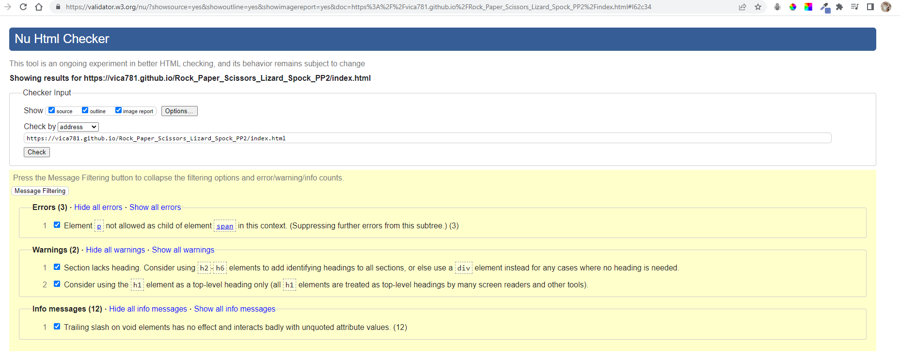
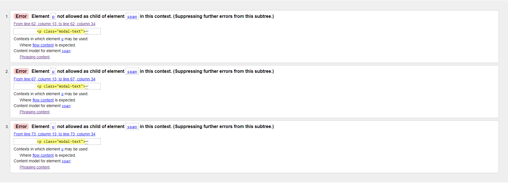
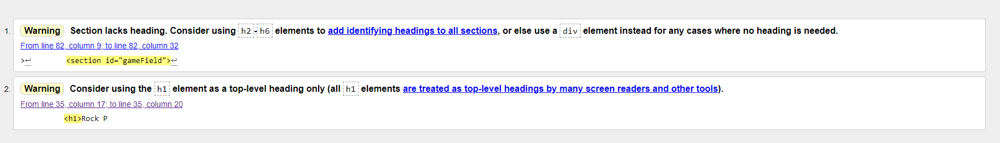
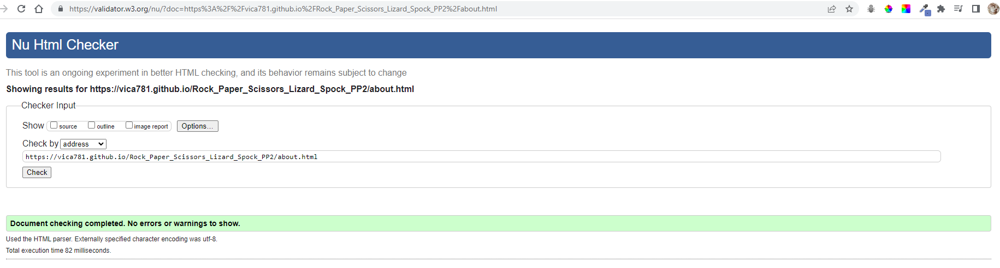
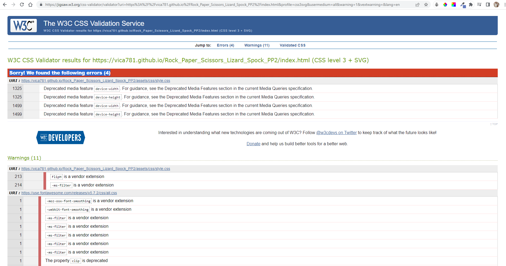
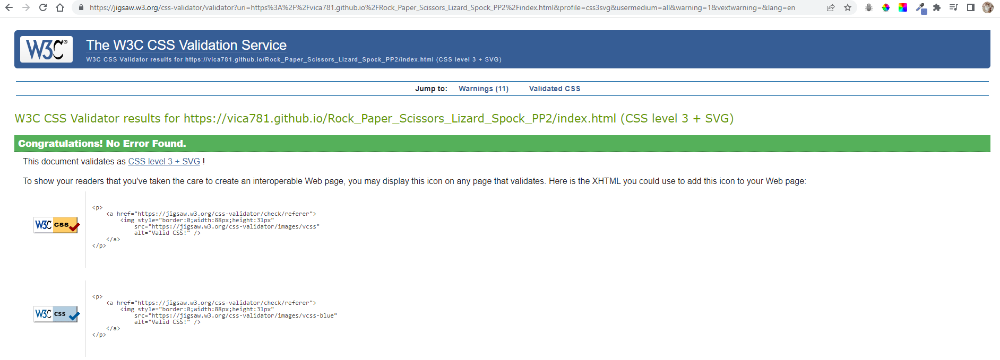
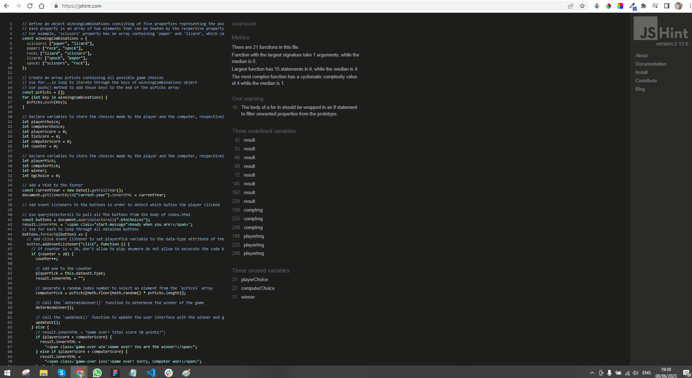
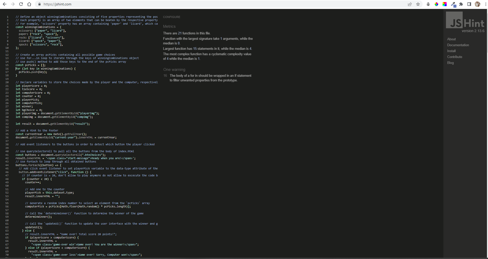
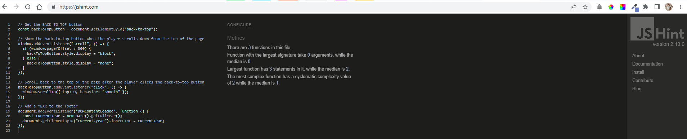
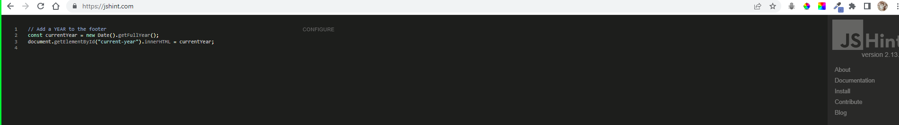

<h1 align="center">Rock Paper Scissors Lizard Spock</h1>

# Testing 

[Main README.md file](/README.md)

[View the live project here](https://vica781.github.io/Rock_Paper_Scissors_Lizard_Spock_PP2/)

***

## Table of contents
1. [Testing User Stories](#testing-user-stories)
2. [Manual Testing](#manual-testing)
3. [Automated Testing](#automated-testing) 
     - [Code Validation](#code-validation)
     - [Browser Validation](#browser-validation)

***

## Testing User Stories

#### <ins>New User Goals<ins>:

As a new user I want to be able to:

1. As a first time visitor, I want to understand the purpose of the site and learn about the game Rock Paper Scissors Lizard Spock.

- Purpose of the site is 

2. As a first time visitor, I want to be able to navigate the website easily, find the game rules and instructions, and be able to start playing the game without any difficulties. 
3. As a first time visitor, I want to enjoy the calming and destressing elements of the website, like the serene nature backgrounds and soothing classical music. 
4. As a first time visitor, I want to explore the About page and learn more about the history, philosophy, educational aspects, logical components, tactical strategies of the game, and interesting facts about the game.
5. As a first time visitor, I want to be able to provide feedback or ask for help in case I need any, either through forums, comments, or social media links, sharing my experience or strategies in playing the game.

[Back to top ⇧](#table-of-contents)

#### <ins>Returning Visitor Goals<ins>

   As a current/returning user I want to be able to:
1. As a returning visitor, I want to be able to play the Rock Paper Scissors Lizard Spock game quickly, without needing to go through lengthy processes or instructions. 
2. As a returning visitor, I want to see new elements or updates in the game, including new nature backgrounds and classical music to keep my experience fresh and enjoyable. 
3. As a returning visitor, I want to find new, fascinating facts, insights, or resources on the About page that enhance my understanding and appreciation of the game. 
4. As a returning visitor, I want a consistent, user-friendly interface where I can easily navigate to my desired sections. 
5. As a returning visitor, I want to engage more with the community, either through forums, comments, or social media links, sharing my experience or strategies in playing the game.

[Back to top ⇧](#table-of-contents)

  

#### Returning Visitor Goals:

[Back to top ⇧](#table-of-contents)

## Manual Testing

[Back to top ⇧](#table-of-contents)

### Common Elements Testing

[Back to top ⇧](#table-of-contents)
     
### Home Page

[Back to top ⇧](#table-of-contents)     

### About Page

[Back to top ⇧](#table-of-contents)
  
### Error (404) Page

[Back to top ⇧](#table-of-contents)    

## Automated Testing

### Code Validation

The [W3C Markup Validator](https://validator.w3.org/) service was used to validate the `HTML` and `CSS` code used. The [JSHint JavaScript Code Quality Tool](https://jshint.com/) was also used to validate the sites `JS` code.

**Results:**

- Home Page

Home Page HTML Validation - First Results

Home Page HTML Validation - Errors

Home Page HTML Validation - Warnings

Home Page HTML Validation - Final

 

- About Page

About Page HTML Validation

 

- Error (404) Page

Error Page HTML Validation

    
   
- CSS stylesheet

Style sheet validation - First

Style sheet validation - Final

 

- JavaScript

JavaScript script.js validation - First

JavaScript script.js validation - Final

JavaScript about.js validation

JavaScript error-page.js validation

[Back to top ⇧](#table-of-contents)

### Browser Validation
- Chrome - [test image]()
- Edge - [test image]()
- Opera - [test image]()
- Firefox - [test image]()
- Safari - [test image]()
- Vivaldi - [test image]()
- Brave - [test image]()

[Back to top ⇧](#table-of-contents)

***
# FROM DISCOVER AMBER 

### Validator Testing

- [HTML Validator](https://validator.w3.org/)

    

### Results after the bugs fixing
   
    
- [CSS Validator](https://jigsaw.w3.org/css-validator/)

    - result for styles.css 
      
    
    ### Lighthouse testing for Performans, Accessibillity, Best Practices and SEO
    ![Lighthouse results Home page]
    ![Lighthouse results About page]
    ![Lighthouse results Error (404) page]
    
    ### Browser Compatibility
  Testing has been carried out on the following browsers :
    - Chrome ![Browser testing]   
    - Firefox ![Browser testing]
    - Edge ![Browser testing]
    - Vivaldi ![Browser testing]
    - Brave ![Browser testing]

    ### Navigation Bar links, Contact Form and Footer icons validation

  - Testing has been carried out on all tabs of the menu bar to make sure that active pages displayed correctly, tabs are changing colour on hover during navigation, and links from the nav tabs are functioning.
    
    

  - Testing has been carried out on all input fields of the Contact Form to make sure that all areas marked as 'required' are functioning properly.  
    
    
 
     