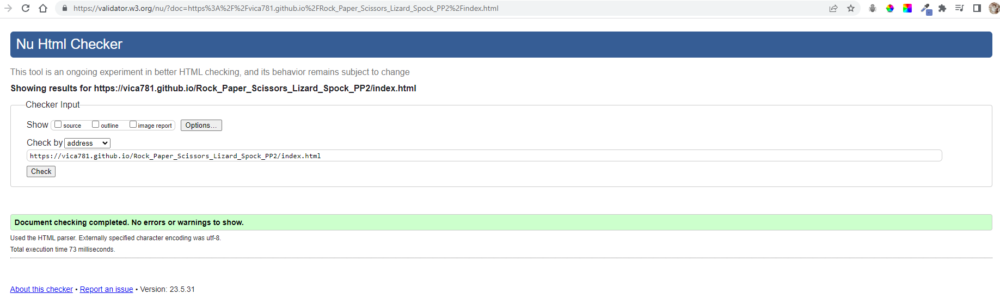
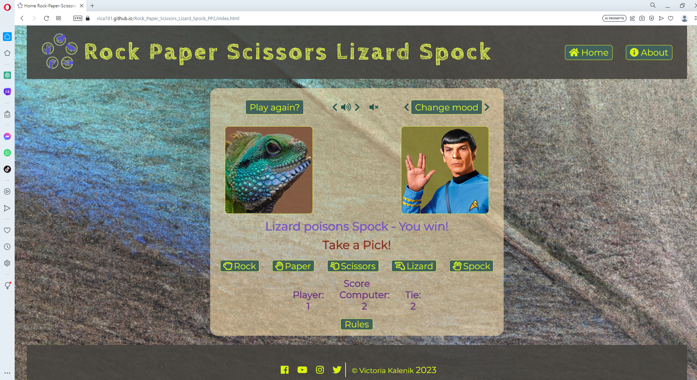
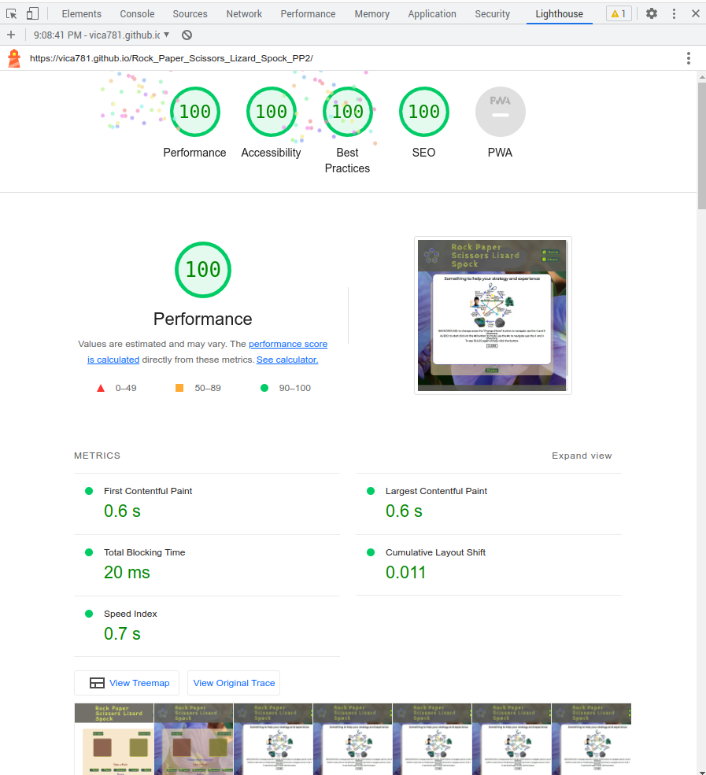

<h1 align="center">Rock Paper Scissors Lizard Spock</h1>

# Testing 

[Main README.md file](/README.md)

[View the live project here](https://vica781.github.io/Rock_Paper_Scissors_Lizard_Spock_PP2/)

***

## Table of contents
1. [Testing User Stories](#testing-user-stories)
2. [Manual Testing](#manual-testing)
3. [Automated Testing](#automated-testing) 
     - [Code Validation](#code-validation)
     - [Browser Validation](#browser-validation)
     - [Lighthouse Validation](#lighthouse-validation)

***

## Testing User Stories

#### <ins>New User Goals<ins>:

As a new user I want to be able to:

1. As a first time visitor, I want to understand the purpose of the site and learn about the game Rock Paper Scissors Lizard Spock.

- Purpose of the site is introduced in the **Game name** that is also a **Main Heading** displayed on the **Navigation Bar**. The user can easely familiarize with the game rules displayed on **Modal** on the load of the Home page or by clicking on the **'Rules'** button displayed at the bottom of the Game Field. The user can also learn more about the game in the **About Page**. The process is fully described and tested in the [Manual Testing](#manual-testing) section and [Existing Features](/README.md) section.

2. As a first time visitor, I want to be able to navigate the website easily, find the game rules and instructions, and be able to start playing the game without any difficulties.

  - The user can navigate the website easily by using the **Navigation Bar buttons** and **Logo**. 
  - The user can intuitively navigate between **Home Page**, **About Page**. Also, user can can leave Error (404) page easely and intuitively. The process is fully described and tested in the [Manual Testing](#manual-testing) section and [Existing Features](/README.md) section.
  - The user is prompted to start playing the game by inviting to action messages displayed at the centre of the easely identifyiable **Game Field**: **'Ready when you are!'** and **'Take a Pick'**. 
  - The  user can start playing the game by clicking on clearly indicative and equipped with worded name and recognizable 'weapon' icons buttons: **'Rock'**, **'Paper'**, **'Scissors'**, **'Lizard'**, **'Spock'**. 
  - The user also assisted by the informative messages during the game: **'You picked ...'**, **'Computer picked ...'**, **'You win!'**, **'You lose!'**, **'It's a draw!'**. For the user 
   convenience all messages distingvisable by the different colours.
  - The user can also start playing the game by clicking on the button with inviting to action message: **'Play again?'** that is displayed at the top of the Game Field. 
  - The **Score Board** located at the top of the Game Field also helps the user to keep track of the game progress. 
   
3. As a first time visitor, I want to enjoy the calming and destressing elements of the website, like the serene nature backgrounds and soothing classical music. 

  - The user can easely and intuitively navigate between the different nature backgrounds by clicking on the **'Change Mood'** button or using **'Back'** and **'Forward'** chevron icons. The process is fully described and tested in the [Manual Testing](#manual-testing) section and [Existing Features](/README.md) section.

  - The user can also control the music by clicking on the **'speaker'** and **'volume off'** icon, **'forward'** and **'back'** chevrons. The process is fully described and tested in the [Manual Testing](#manual-testing) section and [Existing Features](/README.md) section. 
   
4. As a first time visitor, I want to explore the About page and learn more about the history, philosophy, educational aspects, logical components, tactical strategies of the game, and interesting facts about the game.

- The user can learn more about the game in the **About Page**. All  navigation options and available resources are clearly displayed in the **Table of Contents**. The user can easely navigate to the desired section by clicking on the **hyperlink**. The process is fully described and tested in the [Manual Testing](#manual-testing) section and [Existing Features](/README.md) section. 

The process is fully described and tested in the [Manual Testing](#manual-testing) section and [Existing Features](/README.md) section.

[Back to top ⇧](#table-of-contents)

#### <ins>Current and Returning Visitor Goals<ins>

   As a current/returning user I want to be able to:
   
1. As a returning visitor, I want to be able to play the Rock Paper Scissors Lizard Spock game quickly, without needing to go through lengthy processes or instructions. 

2. As a returning visitor, I want to see new elements or updates in the game, including new nature backgrounds and classical music to keep my experience fresh and enjoyable. 

3. As a returning visitor, I want to find new, fascinating facts, insights, or resources on the About page that enhance my understanding and appreciation of the game. 

4. As a returning visitor, I want a consistent, user-friendly interface where I can easily navigate to my desired sections. 

[Back to top ⇧](#table-of-contents)

#### Returning Visitor Goals:

[Back to top ⇧](#table-of-contents)

## Manual Testing

Manual testing was carried out to ensure that all features of the website are working as intended. The following tests were carried out:

- [Common Elements Testing](#common-elements-testing)
- [Home Page](#home-page)
- [About Page](#about-page)
- [Error (404) Page](#error-404-page)

[Back to top ⇧](#table-of-contents)

### Common Elements Testing

- Navigation Bar

  

   

- Footer

  

  [Back to top ⇧](#table-of-contents)
     
### Home Page

- **Modal** (Game Rules)

  

   

- **'Play again?'** button

  

   

- **Audio controls**
Audio controls are working as intended. The user can play music in order it is position on the website by clicking on the 'speaker' icon. The user can also navigate to the next composition by clicking on the 'forwatd' chevron icon or to the previous composition by clicking on the 'back' chevron icon. Also, if the user vould rather stop audio playing, they can click on the 'volume off' icon. The link to the video with **audio testing** is [here](https://youtu.be/Wnn-8dLJUb8).

 

- **'Change Mood'** button (background change controls)

  

   

- **Game controls**

  

  [Back to top ⇧](#table-of-contents)     

### About Page

- **Table of Contents**

  

   

- **'Back-to-top'** button

  

   

- **Hyperlinks**

  

[Back to top ⇧](#table-of-contents)

### Error (404) Page

- **Link** to the **Home Page**

  

[Back to top ⇧](#table-of-contents)    

## Automated Testing

### Code Validation

The [W3C Markup Validator](https://validator.w3.org/) service was used to validate the `HTML` and `CSS` code used. The [JSHint JavaScript Code Quality Tool](https://jshint.com/) was also used to validate the sites `JS` code.

**Results:**

- **Home Page**

Home Page HTML Validation - First Results

Home Page HTML Validation - Errors

Home Page HTML Validation - Warnings

 

  
Home Page HTML Validation - Final

  

 

- **About Page**

    
About Page HTML Validation

  

 

- **Error (404) Page**

    
Error Page HTML Validation

  

- **CSS stylesheet**

Style sheet validation - First

 

   
Style sheet validation - Final

   

- **JavaScript**

JavaScript script.js validation - First

   
JavaScript script.js validation - Final

   

JavaScript about.js validation

JavaScript error-page.js validation

[Back to top ⇧](#table-of-contents)

### Browser Compatibility
  Testing has been carried out on the following browsers :

- **Chrome** 

- **Edge**

- **Opera** 

- **Firefox** 

- **Brave** 

- **Vivaldi**

[Back to top ⇧](#table-of-contents)

### Lighthouse testing for Performans, Accessibillity, Best Practices and SEO

- **Home Page**

Lighthouse validation Home page - 1

        

Lighthouse validation Home page - 2

Lighthouse validation Home page - 3

        

Lighthouse validation Home page - 4

Lighthouse validation Home page - Final

[Back to top ⇧](#table-of-contents)

-  **About Page**

Lighthouse results About page - 1

Lighthouse results About page - 2

Lighthouse results About page - SEO

Lighthouse results About page - SEO

Lighthouse results About page - Best Practices

Lighthouse results About page - Final

[Back to top ⇧](#table-of-contents)

- **Error (404) Page**

Lighthouse results Error (404) page

[Back to top ⇧](#table-of-contents)

***

[Main README.md file](/README.md)

 
     